# Свехразрешающая Сверточная Нейронная Сеть

**Авторы: [Саффар Эмиль](https://github.com/emilsaffar), [Осипов Даниил](https://github.com/SeemsGucci)**

Реализация архитектуры с использованием Deep Learning и PyTorch

## Описание

Этот проект направлен на улучшение качества изображения с использованием данной модели. Приведенное ниже изображение вкратце объясняет, какой результат я хочу получить:

<p align="center">
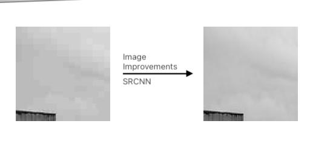
</p>

## Датасет

Набор данных содержит:

**13056 тренировочных изображений (256x128)**

**3200 проверочных изображений (256x128)**.

В этой открытой папке <a href="https://drive.google.com/file/d/1QI3MvHTxFzwZfF1xdgJv0EJqB91yAzMG/view?usp=sharing">Google Drive</a> вы можете найти множество наборов данных изображений, используемых в основном для экспериментов со сверхразрешением

**Все примеры тренировочных и проверочных данных сведены в одну картинку, где слева - качественные, а справа - некачественные.**

<p align="center">
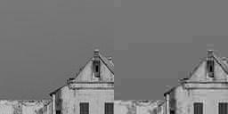
</p>

```sh
# Весь подготовленный набор данных доступен в файле.
Data_Preparing.ipynb
```

```sh
# Класс для подготовки данных к использованию. Он получает каталог изображений, затем получает оттуда данные и разделяет изображения на качественные и некачественные.
class SkylineDataset(Dataset):
    
    def __init__(self, image_dir):
        self.image_dir = image_dir
        self.image_fns = os.listdir(image_dir)
        
    def __len__(self):
        return len(self.image_fns)
    
    def __getitem__(self, index):
        image_fn = self.image_fns[index]
        image_fp = os.path.join(self.image_dir, image_fn)
        image = Image.open(image_fp).convert('L')
        quality, poor = self.split_image(image)
        quality = self.transform(quality)
        poor = self.transform(poor)
        return quality, poor
    
    def split_image(self, image):
        image = np.array(image)
        quality, poor = image[:, :128], image[:, 128:]
        return poor, quality
    def transform(self, image):
        transform_ops = transforms.Compose([
            transforms.ToTensor()
        ])
        return transform_ops(image)
```

После изучения моей задачи я решили, что не существует простого способа реализовать Super Resolution для любого изображения, который хочется.
Я решили сконцентрировать мои усилия на улучшении качества фотографий горизонта. 

```sh
# The quality of original images was decreased by Image function.
size = 1024, 1024
file_path = "some/file/path"
image = Image.open(file_path)
new_image= image.resize(size, Image.ANTIALIAS)
    
save_path = "some/new/file/path"
new_image.save(save_path, optimize=True, quality=20)
```

Начнем с набора данных фотографий горизонта,  но они были слишком большими для существующих моделей: 3024x4032 пикселей.
Можно уменьшить их размер до 1024x1024, но они все равно были слишком большими и сложными для обработки

<p align="center">
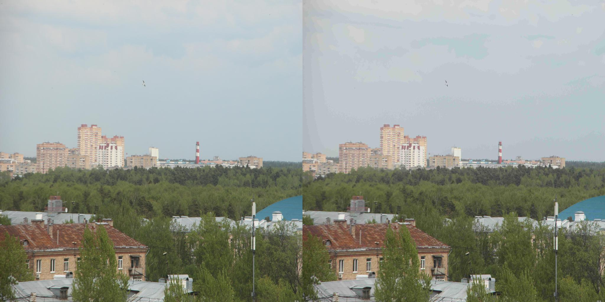
</p>

Так я попытался обрезать их в группы по 16 штук размером 256x256 каждая, но это было бесполезно. В результате получился набор данных из 4000 объектов, что было недостаточно, особенно в непростых областях, где небо и здания находятся вместе. Пикселизация не исчезла, но было добавлено размытие.

<p align="center">
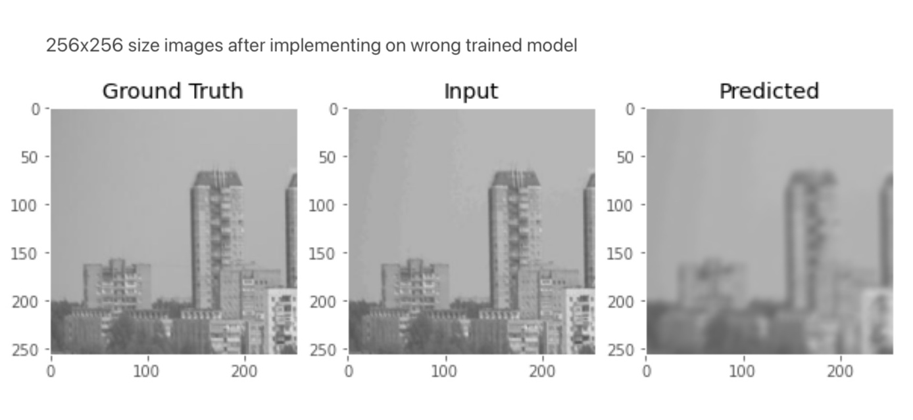
</p>

На последнем этапе подготовки данных изменим цветовые каналы "RGB" на "L" (черно-белый) и разделили исходные изображения на группы по 64 штуки размером 128x128 каждая. Таким образом, мы получили набор данных, который теперь готов к обработке.

<p align="center">
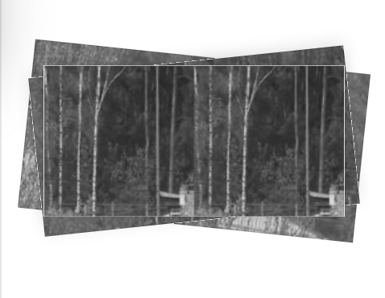
</p>
> Другие изображения были взяты с <a href="https://varlamov.ru">этого</a> сайта

## Модель

Испрользуем архитектуру SRCNN, которая была открыта в этой <a href="https://personal.ie.cuhk.edu.hk/~ccloy/files/eccv_2014_deepresolution.pdf">работе</a>.
По словам авторов:
> Мы предлагаем метод глубокого обучения для сверхразрешения одиночных изображений (SR).
> Наш метод напрямую обучает сквозному отображению между изображениями низкого и высокого разрешения.
> Сопоставление представлено в виде глубокой сверточной нейронной сети (CNN).
> которая принимает на вход изображение низкого разрешения и выдает изображение высокого разрешения. 

Скопировав их архитектуру и обучив модель для улучшения фотографий небоскребов на нашем наборе данных.

По их мнению, SRCNN показывает лучшие результаты при использовании методов Bicubic и SC.

<p align="center">
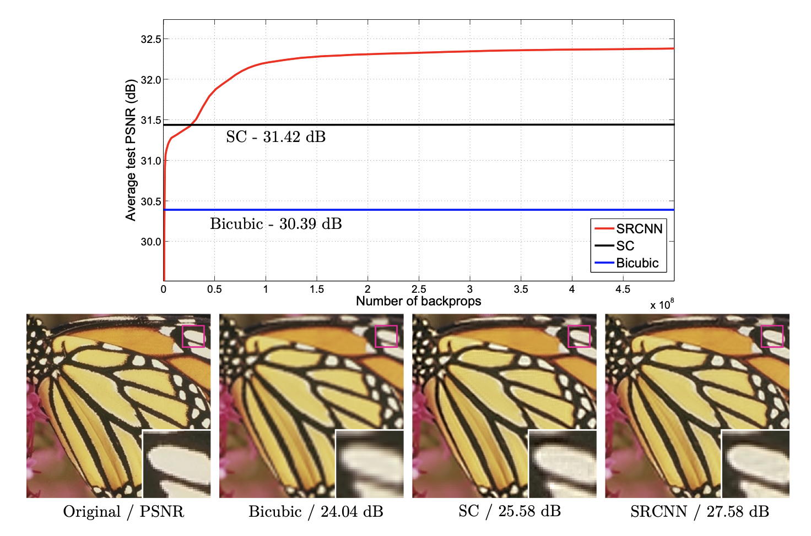
</p>

Но как это работает? Авторы предположили, что для этого достаточно всего 3 слоев.
Получив изображение Y низкого разрешения, первый сверточный слой SRCNN извлекает набор карт признаков. Второй слой нелинейно отображает эти карты признаков на изображения с высоким разрешением. Последний слой объединяет данные прогнозы в пределах соседней области изображения, чтобы получить конечное изображение высокого разрешения F(Y).

<p align="center">
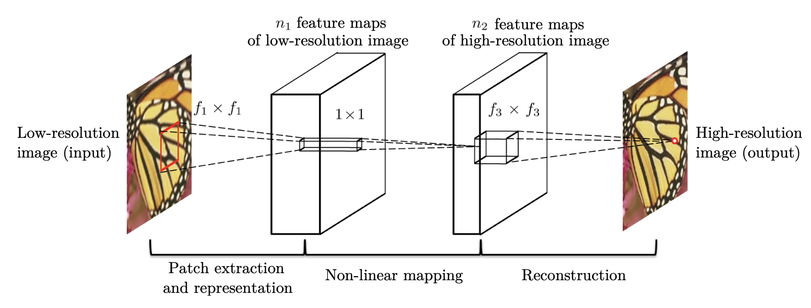
</p>

```sh
import torch.nn as nn
import torch.nn.functional as F
class SRCNN(nn.Module):
  
    def __init__(self):
        super(SRCNN, self).__init__()
        self.conv1 = nn.Conv2d(1, 64, kernel_size=9, padding=2, padding_mode='replicate')
        self.conv2 = nn.Conv2d(64, 32, kernel_size=1, padding=2, padding_mode='replicate')
        self.conv3 = nn.Conv2d(32, 1, kernel_size=5, padding=2, padding_mode='replicate')
    def forward(self, x):
        x = F.relu(self.conv1(x))
        x = F.relu(self.conv2(x))
        x = self.conv3(x)
        return x
```

Train функция:

```sh
def train(model, dataloader):
    model.train()
    running_loss = 0.0
    running_psnr = 0.0
    
    for bi, data in tqdm(enumerate(dataloader), total=int(len(train_data)/dataloader.batch_size)):
        image_data = data[1].to(device)
        label = data[0].to(device)
        
        optimizer.zero_grad()
        outputs = model(image_data)
        
        loss = criterion(label, outputs)
        loss.backward()
        optimizer.step()
        running_loss += loss.item()
        batch_psnr =  psnr(outputs, label)
        running_psnr += batch_psnr
    final_loss = running_loss/len(dataloader.dataset)
    final_psnr = running_psnr/int(len(train_data)/dataloader.batch_size)
    return final_loss, final_psnr
```

## PSNR Функция 
Не получится оценить результат работы нашей модели с помощью потерь или на глаз, поэтому найдем специальную функцию, которая сможет правильно оценить результат за нас. Она называется PSNR или Peak signal-to-noise ratio. Эта функция помогла узнать соотношение между максимально возможной мощностью сигнала (один монохромный канал) и мощностью искажающего шума, который влияет на верность его отражения.

dB (PSNR) - это специальное логарифмическое значение отношения максимального значения пикселя (в нашем одноканальном случае это значение равно 1) к среднеквадратичной ошибке (разница между значением предсказанного пикселя относительно Ground Truth). **Чем выше PSNR, тем лучше**.

Использование этой метрики показалось мне удачной идеей, поскольку она часто используется для оценки сжатия изображений.
Вот как выглядит функция по реализации этого:
```sh
def psnr(label, outputs, max_val=1.):
    """
    Peak Signal to Noise Ratio (the higher the better).
    PSNR = 20 * log10(MAXp) - 10 * log10(MSE).
    label and outputs – Torch tensors.
    """
    label = label.cpu().detach().numpy()
    outputs = outputs.cpu().detach().numpy()
    img_diff = outputs - label
    rmse = math.sqrt(np.mean((img_diff) ** 2))
    if rmse == 0:
        return 100
    else:
        PSNR = 20 * math.log10(max_val / rmse)
        return PSNR
```
## Результат

После обучения данной функции были получены следующие результаты:

<p align="center">
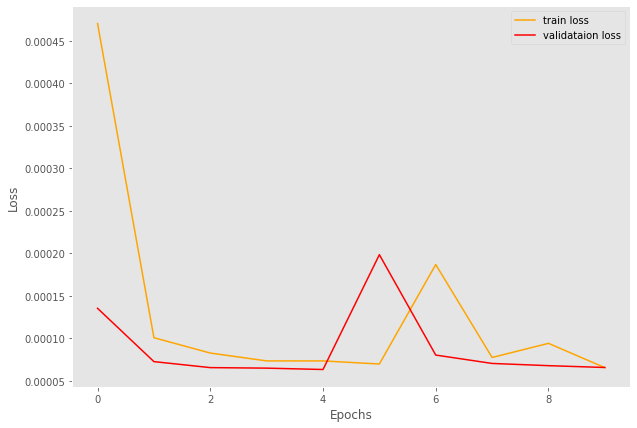
</p>
---
<p align="center">
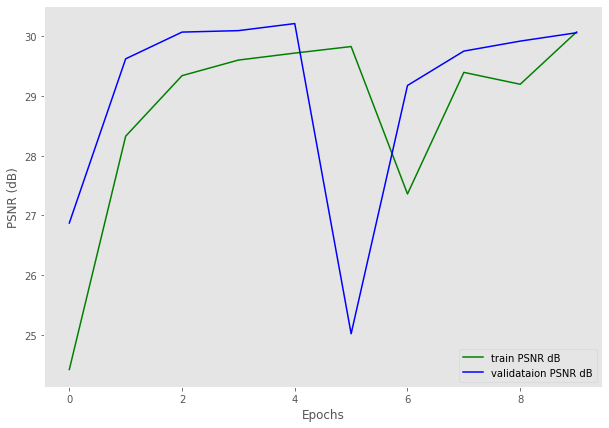
</p>

PSNR рос и остановился около 30 (следует отметить, что диапазон дБ между 30 и 40 считается хорошим результатом). Продолжать обучение не имело смысла, так как потери перестали уменьшаться.

Было протестировано множество изображений:

```sh
test_batch_size = 8
dataset = SkylineDataset(train_dir)
data_loader = DataLoader(dataset, batch_size=test_batch_size)
X, Y = next(iter(data_loader))
Y_pred = model(X)
fig, axes = plt.subplots(1, 3, figsize=(10, 5))
use_image = 7
truth = torchvision.utils.make_grid(Y[use_image], nrow=1)
truth = truth.permute(1, 2, 0).detach().numpy()
input = torchvision.utils.make_grid(X[use_image], nrow=1)
input = input.permute(1, 2, 0).detach().numpy()
pred = torchvision.utils.make_grid(Y_pred[use_image], nrow=1)
pred = pred.permute(1, 2, 0).detach().numpy()
axes[0].imshow(truth)
axes[0].set_title("Ground Truth")
axes[1].imshow(input)
axes[1].set_title("Input")
axes[2].imshow(pred)
axes[2].set_title("Predicted")
```
 И получился предсказуемый результат:

 <p align="center">
 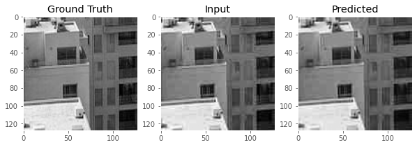
 </p>

 Это приблизительное улучшение качества изображения с помощью нашей модели:
| Вход dB | выход dB | Улучшение |
| ------ | ------ | ------ |
| 28 | 31 | 10.7% |

Взяв случайную фотографию не из нашего набора данных, изменив ее размер до 1024x1024. Затем мы обрезали ее на 64 части и применили к нашей модели, после чего собрали ее снова. Вот результат:

<p align="center">
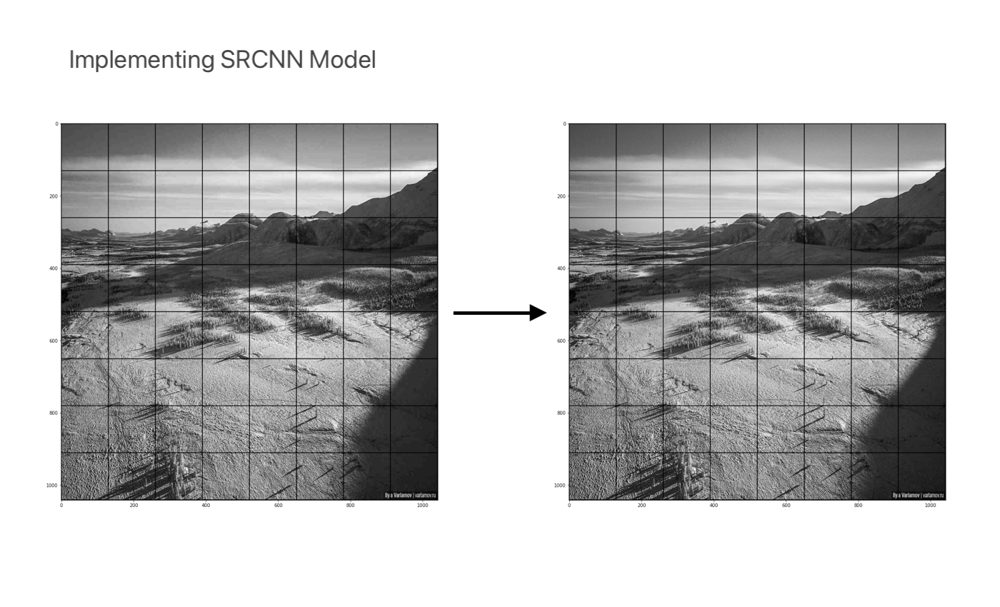
</p>

**Лучшие из них представлены в следущем файле:**

```sh
chechpoint.pth
```

И просто примените его к модели SRCNN:

```sh
model = SRCNN().to(device)
model.load_state_dict(torch.load('checkpoint.pth'))
```
